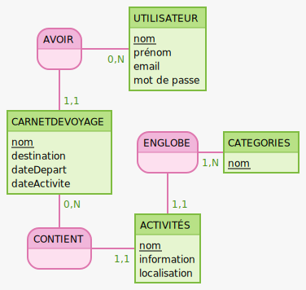

# MCD EasyTrip

AVOIR, 11 CARNETDEVOYAGE, 0N UTILISATEUR
UTILISATEUR: nom, prénom, email, mot de passe

CARNETDEVOYAGE: nom, destination, dateDepart, dateActivite
ENGLOBE, 1N CATEGORIES, 11 ACTIVITÉS
CATEGORIES: nom

CONTIENT, 11 ACTIVITÉS, 0N CARNETDEVOYAGE
ACTIVITÉS: nom, information, localisation

## Synthèse du MCD

* L'utilisateur peut avoir plusieurs carnets de voyages, tandis qu'un carnet de voyage ne peut appartenir qu'à un seul utilisateur.

* Un carnet de voyage peut contenir plusieurs activités.

* Une catégorie peut englober plusieurs activités tandis qu'une activité n'appartient qu'à une seule catégorie.
